# edge-grafana

A dashboarding application for Industrial Edge to Query, visualize, alert on and understand your metrics no matter where they are stored.

- [edge-grafana](#edge-grafana)
  - [Introduction](#introduction)
    - [Before starting](#before-starting)
  - [Requirements](#requirements)
    - [Used components](#used-components)
    - [Hardware Requirements](#hardware-requirements)
    - [Software requirements](#software-requirements)
  - [Installation](#installation)
    - [Download the application](#download-the-application)
    - [Import an application in .app format](#import-an-application-in-app-format)
    - [Create a new standalone application](#create-a-new-standalone-application)
    - [Upload the application to Industrial Edge Management](#upload-the-application-to-industrial-edge-management)
      - [Link your Industrial Edge App Publisher](#link-your-industrial-edge-app-publisher)
      - [Import a standalone application into Industrial Edge Management](#import-a-standalone-application-into-industrial-edge-management)
  - [Usage](#usage)
    - [Connecting to the edge-grafana Web UI](#connecting-to-the-edge-grafana-web-ui)
    - [Connecting to the grafana-static-server Web UI](#connecting-to-the-grafana-static-server-web-ui)
    - [Adding and Testing a Datasource Connection](#adding-and-testing-a-datasource-connection)
  - [Application Examples](#application-examples)
    - [Description](#description)
    - [Before starting with the examples](#before-starting-with-the-examples)
    - [Viewing data using Industrial Edge DataService Datasource](#viewing-data-using-industrial-edge-dataservice-datasource)
      - [Configure the Industrial Edge DataService Datasource](#configure-the-industrial-edge-dataservice-datasource)
      - [Configure a dashboard with Industrial Edge DataService datasource](#configure-a-dashboard-with-industrial-edge-dataservice-datasource)
    - [Visualize data using edge-postgresql plugin](#visualize-data-using-edge-postgresql-plugin)
    - [Dashboard with dynamic table and CSV export](#dashboard-with-dynamic-table-and-csv-export)
      - [Add new variables in a Grafana Dashboard](#add-new-variables-in-a-grafana-dashboard)
      - [Using variables within a Grafana Panel Table](#using-variables-within-a-grafana-panel-table)
      - [Table data export to CSV](#table-data-export-to-csv)
    - [Visualize Web UI of other Edge Apps with Text Panel](#visualize-web-ui-of-other-edge-apps-with-text-panel)
    - [Visualize Images through grafana-static-server](#visualize-images-through-grafana-static-server)
      - [Upload image with grafana-static-server](#upload-image-with-grafana-static-server)
      - [Display image in a Grafana dashboard](#display-image-in-a-grafana-dashboard)
  - [Build](#build)
    - [Building Steps](#building-steps)
    - [Grafana Configuration Changes](#grafana-configuration-changes)
  - [Documentation](#documentation)
  - [Contribution](#contribution)
  - [License & Legal Information](#license--legal-information)

## Introduction

The edge-grafana application allows you to bring the popular [Grafana OSS software](https://grafana.com/oss/grafana/) directly to the Siemens Industrial Edge platform, allowing you to query, visualize and understand your data, regardless of where it is stored. With Grafana you can create, explore and share all your data through elegant and flexible dashboards.

For more information about Grafana check out the [Documentation](#documentation) section.

### Before starting

This guide describes how to use and install the edge-grafana app.

Check the requirements in the [Requirements](#requirements) section before proceeding with the installation. Details for the installation procedure can be found in the [Installation](#installation) section.

For details on how to use the Grafana service see the Using section and for all online references on using it see the [Documentation](#documentation) section.

The application comes with some [Application Examples](#application-examples) in the dedicated section.

The [Build](#build) section shows in detail how this application was built using the Docker environment

## Requirements

### Used components

- OS: Windows or Linux
- Docker minimum V18.09
- Docker Compose V2.0 - V2.4
- Industrial Edge App Publisher (IEAP) V1.3.7
- Industrial Edge Management (IEM) V1.4.3
- Industrial Edge Device (IED) V1.3.0-57

### Hardware Requirements

The edge-grafana application is only compatible with SIEMENS devices that have Industrial Edge functionality enabled.

### Software requirements

The edge-grafana application needs 1174 MB of RAM to run so divided among the used services:

| Service Name | Memory Limit |
|--------------|--------------|
| edge-grafana | 1024 MB |
| grafana-static-server | 150 MB |

> **Note:** This limit has been set for an average volume of data read by Grafana and to ensure a constant average usage of dashboards, tasks and other functions, but can be modified according to your needs by acting on the docker-compose file and then on the app configuration in the Edge App Publisher software, creating a custom version of this application.

## Installation

Below you will find the steps required to download the pre-compiled app or to create and install an edge app from the source code provided here.

You can either import a directly downloadable .app file below, or use the provided source code to build a new app from scratch.

Please refer to the [Documentation](#documentation) section for detailed information on Industrial Edge application development.

### Download the application

The **edge-grafana** application can be downloaded in .app format using this secure Google Drive link:

- [edge-grafana_8.2.5.app](https://drive.google.com/file/d/1H1TJo-yjp0q9MBLdkMAfUHyM3WOhYFN5/view?usp=sharing)

### Import an application in .app format

- Open the **Industrial Edge App Publisher** software
- Import the `edge-grafana_8.2.5.app` file using the **Import** button
- The new imported application will appear in the **Standalone Applications** section

### Create a new standalone application

- Open the **Industrial Edge App Publisher** software
- Go to the **Standalone Applications** section and create a new application
- Import the [docker-compose](docker-compose.yml) file using the **Import YAML** button
- Click on **Review** and then on **Validate & Create**.

### Upload the application to Industrial Edge Management

Below is a brief description on how to publish your application to your IEM.

For more detailed information please see the official Industrial Edge GitHub guide to [uploading apps to the IEM](https://github.com/industrial-edge/upload-app-to-industrial-edge-management) and the [Documentation](#documentation) section.

#### Link your Industrial Edge App Publisher

- Connect your Industrial Edge App Publisher to your **Docker Engine**
- Connect your Industrial Edge App Publisher to your **Industrial Edge Management**

#### Import a standalone application into Industrial Edge Management

- Create a new **Apps project** in the connected IEM or select an existing one
- Import the app version created in the **Standalone Applications** section into the selected IEM project
- Press **Start Upload** to transfer the application into Industrial Edge Management

## Usage

The edge-grafana application is based on the [Grafana OSS software](https://grafana.com/oss/grafana/).

For more information on using Grafana OSS, see the [official documentation](https://grafana.com/docs/grafana/latest/) and the [Documentation](#documentation) section.

The following are specific to how to use the app, as shown in the [Build](#build) section.

### Connecting to the edge-grafana Web UI

The edge-grafana application exposes a Web UI where all the features of the Grafana OSS software can be used. Both an HTTPS and an HTTP connection have been implemented in order to reach the Grafana Web UI:

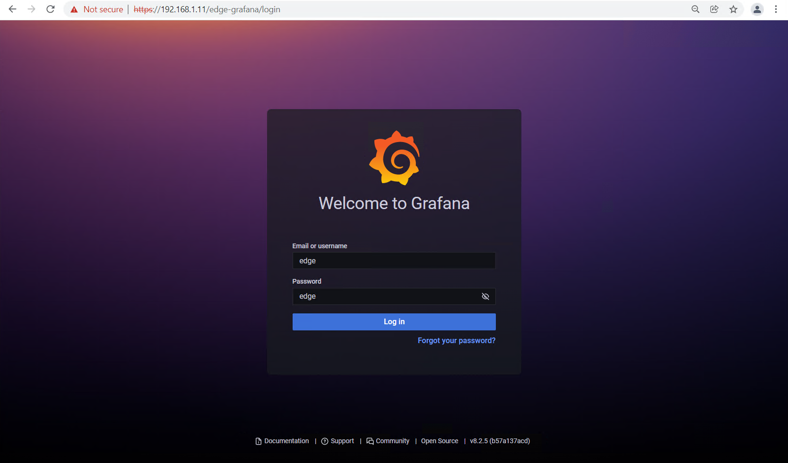

Connect to WebUI with HTTPS protocol via Reverse Proxy functionality _(Login on IED required)_:

- `https://[ip-address]/edge-grafana/`

Connect to WebUI with HTTP protocol

- `http://[ip-address]:33000`

The default user _"edge"_ with password _"edge"_ can access the WebUI, and is defined in the docker-compose file via the `GF_SECURITY_ADMIN_USER` and `GF_SECURITY_ADMIN_PASSWORD` environment variables.
See the [Build](#build) section for more information.

### Connecting to the grafana-static-server Web UI

Along with the edge-grafana service, there is a service inside the application called **grafana-static-server**, a webserver with an API for uploading files such as images or others that can be displayed or requested by edge-grafana.
For more information on how to use grafana-static-server see the [Application Examples](#application-examples) section.

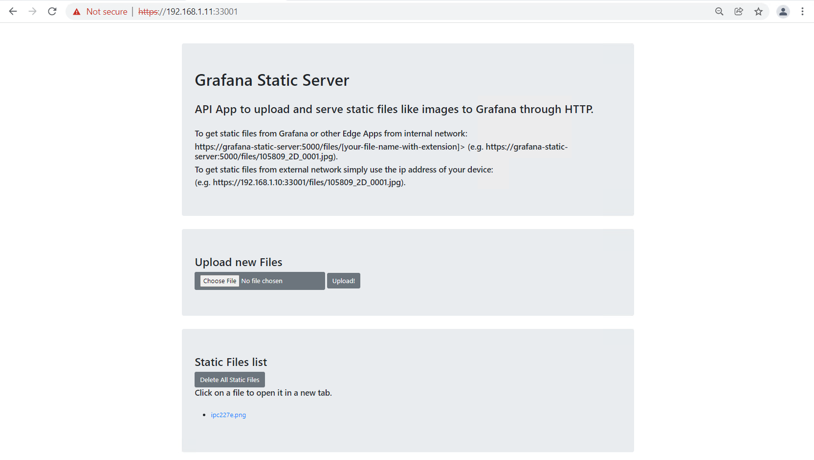

Connect to WebUI with HTTPS protocol via:

- `https://[ip-address]:33001`

### Adding and Testing a Datasource Connection

Through the menu **Configuration → Data Sources** you can add, edit and test connections to different dat to databases from which to receive data to display.

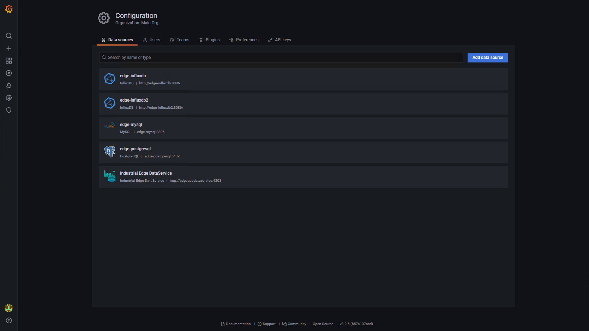

Thanks to Grafana's [provisioning](https://grafana.com/docs/grafana/latest/administration/provisioning/) capabilities, some custom changes have been introduced in terms of default configurations to the base Grafana application.

For example, the following pre-configured Datasources are already available:

- **edge-influxdb:** default connection to the [edge-influxdata-stack](https://github.com/SiemensIndustrialEdgeITA/edge-influxdata-stack) app
- **edge-influxdb2:** Default connection to the [edge-influxdb2](https://github.com/SiemensIndustrialEdgeITA//edge-influxdb2) app
- **edge-postgresql:** Default connection to the [edge-postgresql](https://github.com/SiemensIndustrialEdgeITA/edge-postgresql) app
- **edge-mysql:** Default connection to the edge-mysql app (in preparation)

For more information on how to use these data sources to get data visualization dashboards see the [Application Examples](#application-examples) section.

## Application Examples

### Description

Using the functionality offered by the provided application and the applications listed in the following section you will be able to implement various functionalities:

- Visualize data via Industrial Edge DataService Datasource
- Visualize data through edge-postgresql plugin
- Dashboard with dynamic table and CSV export
- Visualize Web UI of other Edge Apps with Text Panel
- Visualize Images with graphana-static-server

### Before starting with the examples

- The **SIMATIC IE DataService** application must be installed and configured on the Edge Device used.
- The **SIMATIC Flow Creator** application must be installed on the Edge Device used.
- The **edge-grafana** application must be installed on the Edge Device being used. Follow the [Installation](#installation) section for more details.
- The [examples](examples) folder contains the dashboards and files used in the various examples below.

### Viewing data using Industrial Edge DataService Datasource

The [Industrial Edge DataService](https://www.dex.siemens.com/edge/industrial-edge-marketplace/data-service?viewState=DetailView&cartID=&portalUser=&store=&cclcl=en_US&selected=edge) application users can store and structure machine data on an Industrial Edge device. Machines and production lines can be structured and in Assets. Reusing structures defined via Aspects speeds up configuration.
Thanks to the **API** described in the **Data Service Development Kit**, the DataService application offers the possibility to make your app suitable for Industrial Edge. Using the built-in API interface, you save your app's data in the Data Service database structure and retrieve it when needed. This means that other apps, such as Performance Insight or Notifier, can easily access the data and use it for themselves.

See the [Documentation](#documentation) section for more information.

Integrated in the edge-grafana service there is a Datasource Plugin for Grafana called [industrialedge-dataservice-datasource](https://github.com/SiemensIndustrialEdgeITA/industrialedge-dataservice-datasource) that allows queries to be made to an Industrial Edge DataService application installed on the same IED. Queries can receive raw data or aggregated data depending on the options selected during query configuration.

Through this plugin it will be possible to explore the variables present inside the Data Model configured in the specific DataService application installed and make different types of queries to display the desired data.

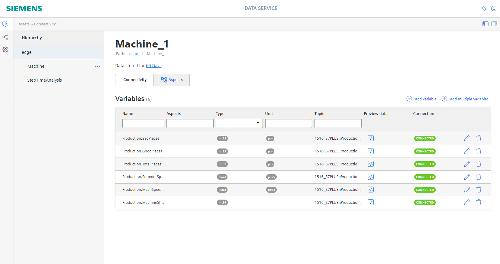

In this example we will use a DataService instance with the variables belonging to the `Machine_1` asset visible in the image above.

#### Configure the Industrial Edge DataService Datasource

To configure the connection to an Industrial Edge DataService application, it will be necessary to add a new **Grafana Datasource** as this connection is not predefined within the application.
In the [Usage](#adding-and-testing-a-datasource-connection) section it is specified how to access the menu dedicated to Grafana Datasources.

- From the menu **Configuration → Data Sources** press **Add Datasource**
Select from **Others** category the **Industrial Edge DataService** plugin and press **Select**

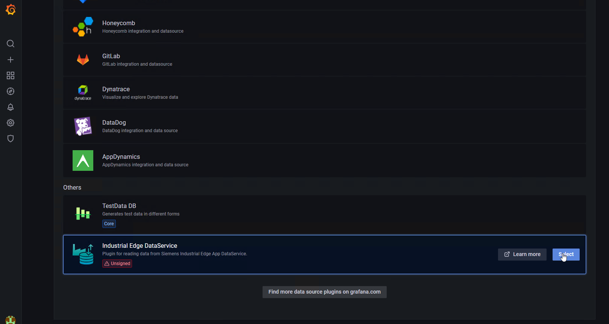

- Configure the new datasource by entering the **URL** of the desired Industrial Edge DataService application. The two applications must be installed on the same IED and the URL of the DataService `http://edgeappdataservice:4203` must be used. It is possible to **test** the connection to verify the correct connection.

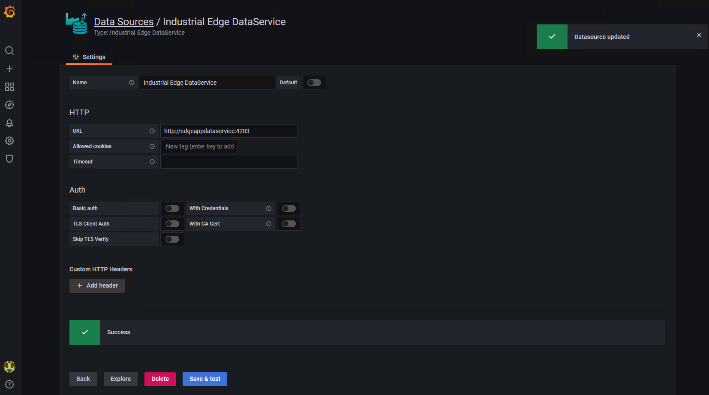

#### Configure a dashboard with Industrial Edge DataService datasource

In this example it will be shown how to visualize the variables present inside an Asset configured in DataService and purchased through the S7 Connector application.

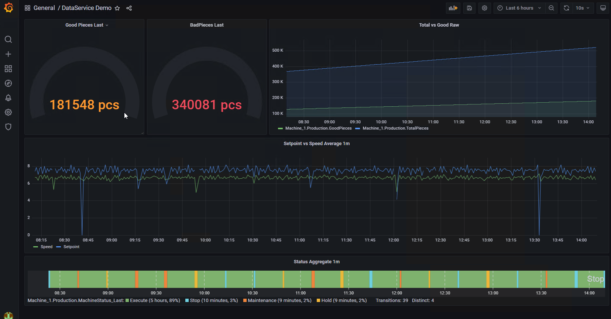

The dashboard displayed above is available in the file [examples/DataService_Dashboard.json](examples/DataService_Dashboard.json).

For example, to display only the **last value** of a variable with a Panel of type **Gauge**:

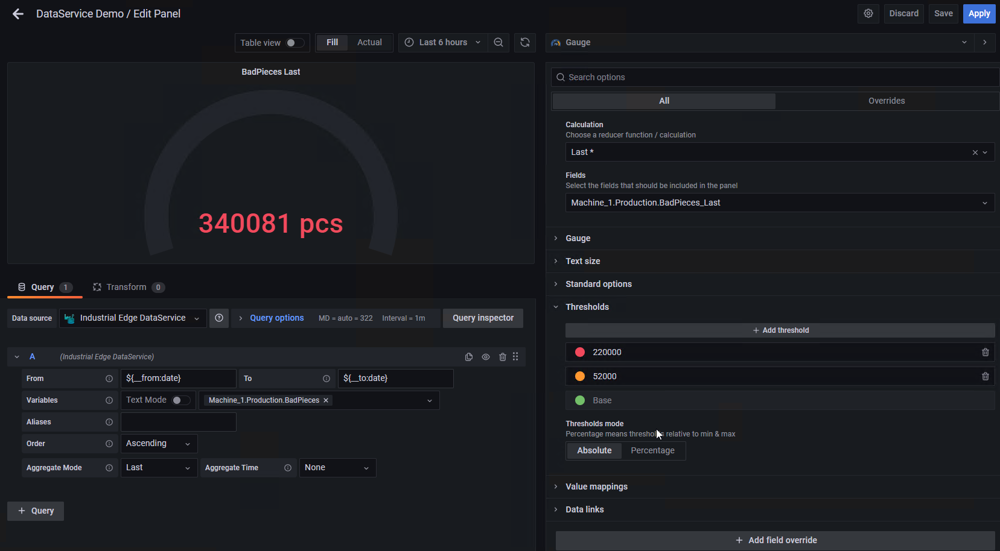

- From the Grafana Home Page create a new dashboard or open an existing one
- Insert a new Panel through the **Add Panel** button
- Select the **Gauge** Panel as display type
- The **From - To** time filter is automatically set to the global time interval of the Grafana Dashboard, but it is possible to insert either other Grafana Global Variables or a static value with date in ISO format.
- Select the variable to be read from the **Variables** drop-down menu
- Select the **Aggregates mode** with the `Last` option to receive the last value in the time unit
- Use `None` as **aggregation time** in order to receive only one value
- Configure the object with graphical properties such as **Thresholds**, **Units** and others through Grafana's options

For example, to display several **"raw data"** series with a Panel of type **Time Series**:

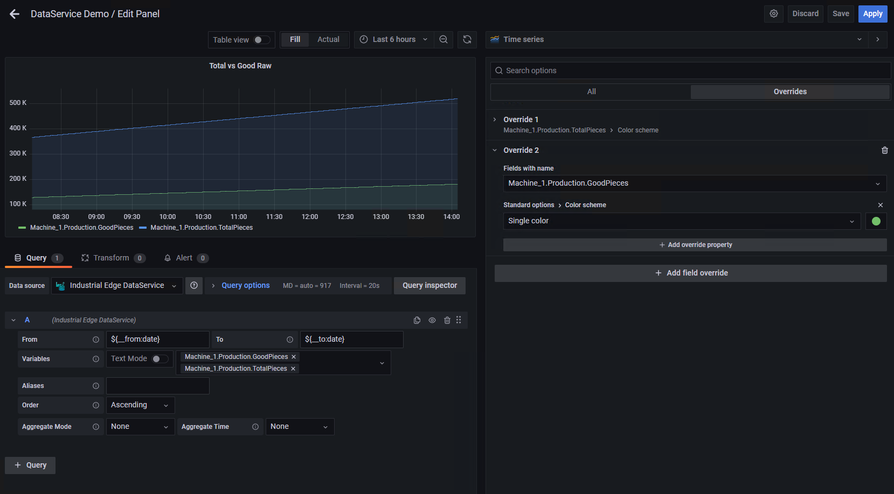

- From the Grafana Home Page create a new dashboard or open an existing one
- Insert a new Panel through the **Add Panel** button
- Select the **Time Series** Panel to be the type of visualization
- The **From - To** time filter is automatically set to the global time interval of the Grafana Dashboard, but it is possible to insert either other Grafana Global Variables or a static value with date in ISO format.
- Select from the **Variables** dropdown menu the variables to read
- Select the **Aggregates mode** with the `None` option to receive all data in the time interval
- Use `None` as **aggregation time**
- Configure the object with graphical properties such as **Colors**, **Thresholds** and other through the Grafana options

You can also display several sets of **aggregated data with a grouping over time** with a minimum of 1 minute via a **Time Series** Panel type:

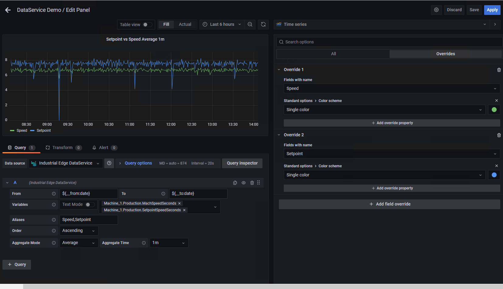

- From the Grafana Home Page create a new dashboard or open an existing one
- Insert a new Panel through the **Add Panel** button
- Select the **Time Series** Panel as display type
- The **From - To** time filter is automatically set to the global time interval of the Grafana Dashboard, but it is possible to insert either other Grafana Global Variables or a static value with date in ISO format.
- Select the variable to be read from the **Variables** drop-down menu
- Select the **Aggregates mode** with the `Average` option to receive the average of the values in the aggregation time unit
- Use `1m` as the **aggregation time** in order to receive a series of values corresponding to the average of the variable every minute.
- Configure the object with graphical properties such as **Thresholds**, **Units** and others through Grafana options

### Visualize data using edge-postgresql plugin

In order to visualize data from a **PostgreSQL database** you can refer to the [Grafana for PostgreSQL guide](https://grafana.com/docs/grafana/latest/datasources/postgres/).

Also available is the [application example](https://github.com/SiemensIndustrialEdgeITA/edge-postgresql#data-visualization-dashboard-with-grafana) of the **edge-postgresql** application directly on the dedicated repository.

### Dashboard with dynamic table and CSV export

Each Grafana Dashboard can be equipped with [Variables](https://grafana.com/docs/grafana/latest/variables/variable-types/) of different types that can be used within the queries of the various Panels combined with selectors that can be used as filters for the data displayed in the dashboard.

This example will show how it is possible to use Grafana variables to build a Dashboard with a dynamic data table that can display data from different tables of a database and'cement which columns should be visible in the Grafana Table Panel.
Using Grafana's built-in Panel functions, it will also be possible to export the data displayed in the table in CSV format.

For this example application Grafana will be connected to the [edge-postgresql](https://github.com/SiemensIndustrialEdgeITA/edge-postgresql) app that uses a PostgreSQL database, but by adap because the queries of the variables considered, it will be possible to apply the same dashboard to other databases.

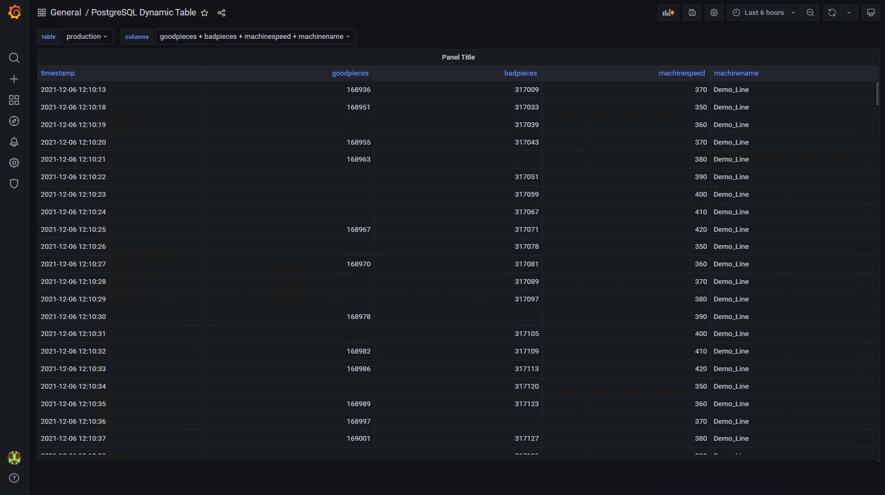

The dashboard displayed above is available in the file [examples/DynamicTable_Dashboard.json](examples/DynamicTable_Dashboard.json).

The PostgreSQL database considered in this example has name `edge` and contains two tables `production` and `speed`, with their respective columns.
In the dashboard you can see on the top left two selectors `table` and `columns` related to the two query variables "table" and "columns". The variable "table" has the purpose of searching inside the PostgreSQL database for all the tables present. The variable "columns" will be the result of the query that looks for all the column names of the table selected by the variable "table".

#### Add new variables in a Grafana Dashboard

- From the Grafana Home Page, create a new dashboard or open an existing one
- Press the **Dashboard Settings** button in the top right corner
- Go to the **Variables** section
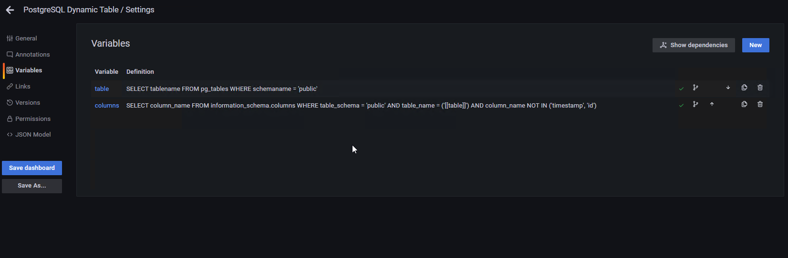

- Add the variable `table` using the following query to get all tables of the default schema `public`

    ```sql
    SELECT tablename FROM pg_tables WHERE schemaname = 'public'
    ```

- Add the variable `columns` of type query
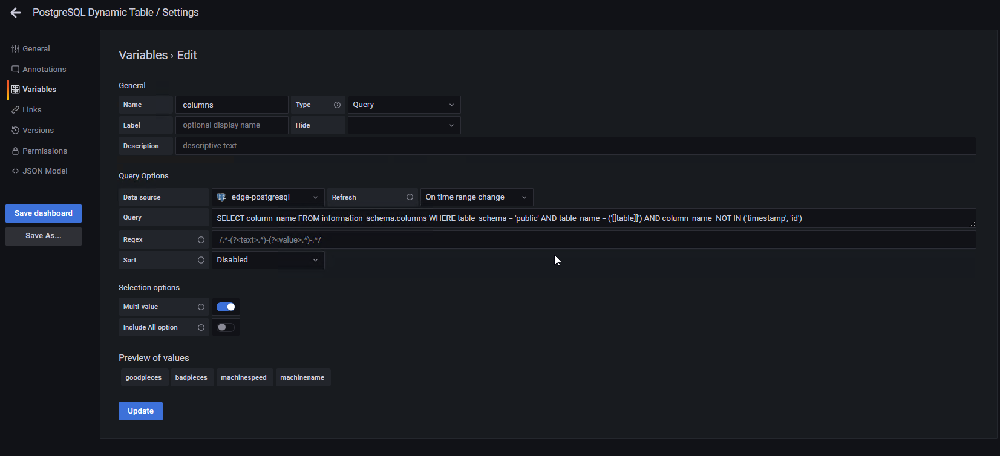

    The **query** to be used to get all the columns (except timestamp and id columns, which are not columns we want to to filter) of the table identified by the variable `table` is the following:

    ```sql
    SELECT column_name
    FROM information_schema.columns
    WHERE table_schema = 'public' 
        AND table_name name = ('[[table]]') 
        AND column_name NOT IN ('timestamp', 'id')
    ```

- Save changes and return to the dashboard

#### Using variables within a Grafana Panel Table

To use the variables created in the previous section within a query to the PostgreSQL database in order to dynamize the appearance and data of the table:

- From the Grafana Home Page create a new dashboard or open an existing one
- Insert a new Panel using the **Add Panel** button
- Select the **Table** Panel as display type

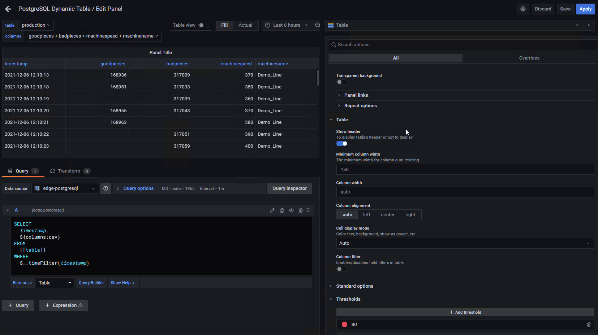

- Insert the following **query** in order to get the table and the respective columns selected using the variables created above. The `timestamp` column is always present so that the data can be sorted:

    ```sql
    SELECT
        timestamp,
        ${columns:csv}
    FROM
        [[table]]
    WHERE
        $__timeFilter(timestamp)
    ```

- Customize the look of the table using the related options and save the new Panel

Now you will be able to view all tables within the PostgreSQL database and once you select one of them, you can filter which columns will be visible.

#### Table data export to CSV

Each Grafana Panel allows you to export the currently displayed data in CSV format using the Inspect feature.

To be able to export the data displayed from the table created above:

- Press on the title of the Panel **Table** to access the specific menu

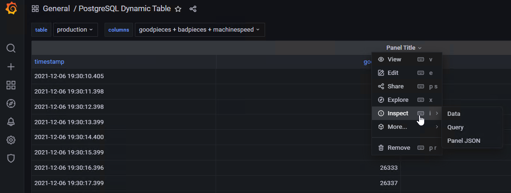

- Press the **Inspect** button and then **Data** button
- From the side menu press the **Download CSV** button to download a CSV file containing the selected data

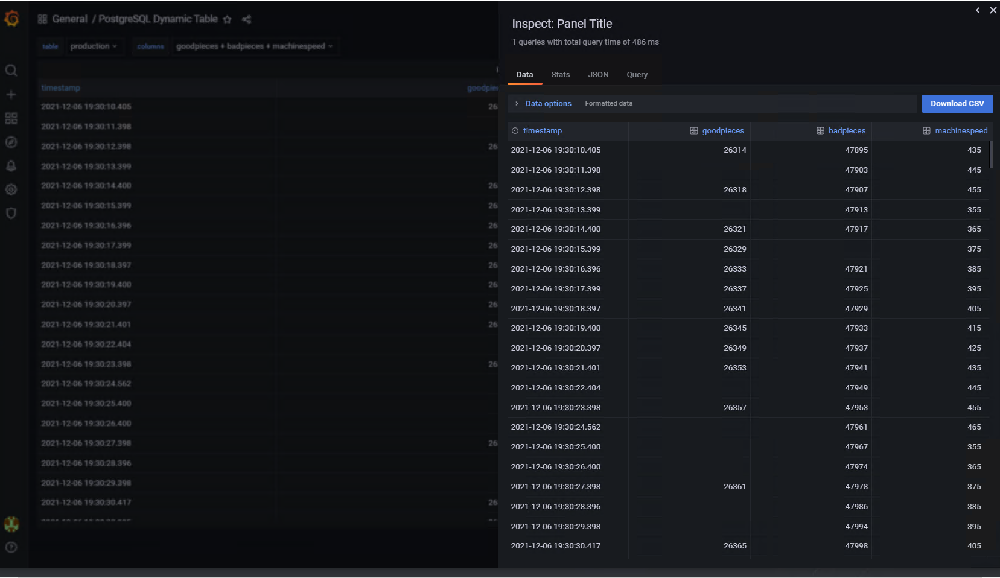

### Visualize Web UI of other Edge Apps with Text Panel

Thanks to [Grafana Text Panel](https://grafana.com/docs/grafana/latest/visualizations/text-panel/) it is possible to insert HTML code to visualize dynamic components and Web pages external to the Grafana environment.

This example will show how to visualize two Web pages inside two Grafana Panels thanks to the [HTML iframe tag](https://developer.mozilla.org/en-US/docs/Web/HTML/Element/iframe?retiredLocale=en).

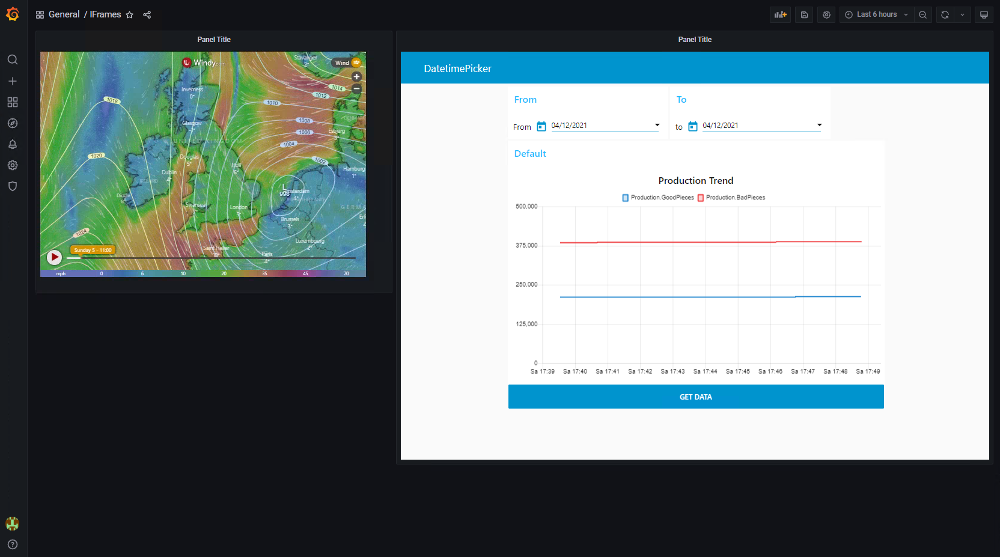

The dashboard displayed above is available in the file [examples/IFrames_Dashboard.json](examples/IFrames_Dashboard.json).

To view, for example, a dashboard created in the **Industrial Edge Flow Creator** application:

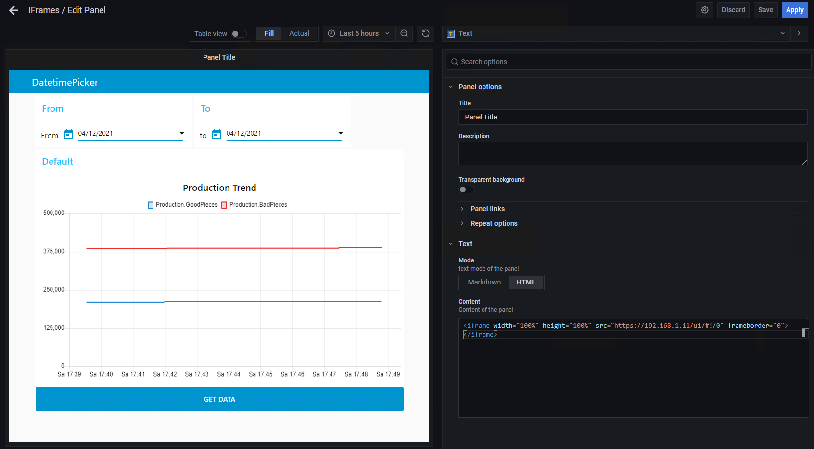

- From the Grafana Home Page create a new dashboard or open an existing one
- Insert a new panel using the **Add Panel** button
- Select the **Text** panel as visualization type
- Select in the Configuration the **HTML** mode
- Insert in the **Content** field the following HTML code, customizing the `src` property of the iframe tag with the address of the Web page to visualize:

```html
<iframe width="100%" height="100%" src="https://192.168.1.11/ui/#!/0" frameborder="0">
</iframe>
```

You can also display dynamic content on an external network like the following:

```html
<iframe width="650" height="450" src="https://embed.windy.com/embed2.html?lat=53.775&lon=-3.252&zoom=5&level=surface&overlay=wind&menu=&message=true&marker=&calendar=&pressure=true&type=map&location=coordinates&detail=&detailLat=55.952&detailLon=-3.196&metricWind=mph&metricTemp=%C2%B0C&radarRange=-1" frameborder="0"></iframe>
```

### Visualize Images through grafana-static-server

Thanks to the pre-installed [Grafana ePict Panel](https://grafana.com/grafana/plugins/larona-epict-panel/) it is possible to integrate in your dashboard a Panel that visualizes an image and also to superimpose to the image dynamic led values or indicators according to the configured data queries.

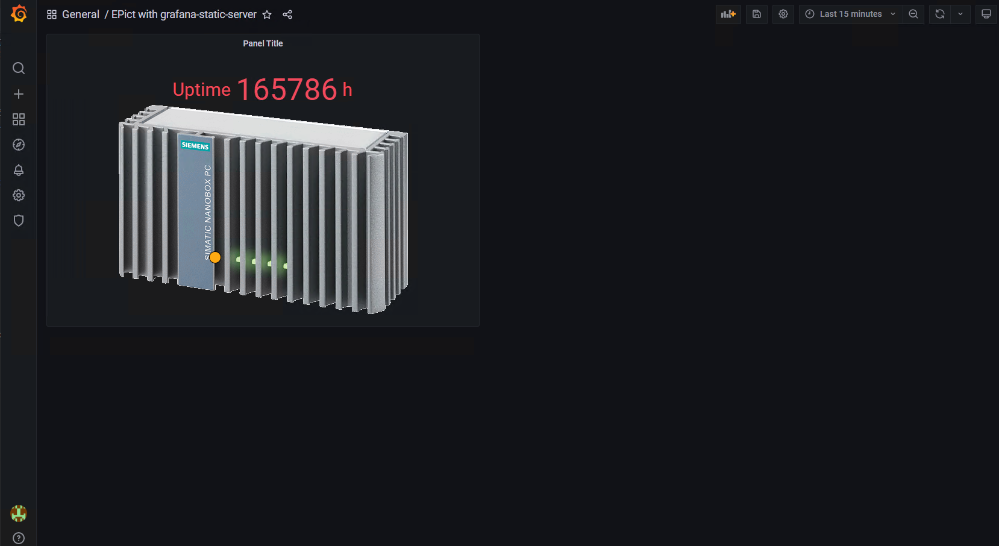

The dashboard displayed above is available in the file [examples/Images_Dashboard.json](examples/Images_Dashboard.json).

The image must be reachable through a URL, and for this reason the application has been equipped with the **grafana-static-server** service, a webserver with a web page that allows the upload of files and an API dedicated to the visualization of the uploaded files. To access the web page of grafana-static-server see the section in [Usage](#connecting-to-the-grafana-static-server-web-ui).

In this example it will be shown how to upload a PNG image to grafana-static-server and display it through a grafana ePict Panel.

#### Upload image with grafana-static-server

- Open the **grafana-static-server** web page with the URL `https://[ip-address]:33001`
- Press the **Choose File** button and select the image you want to upload.

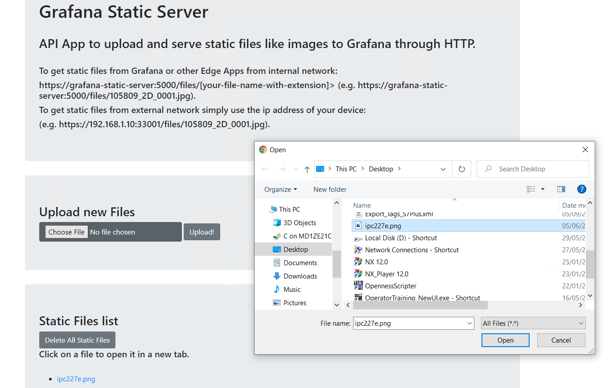

- Press **Upload!** button and wait for the file name to appear in the **Static Files List**
- To view the image press on the filename or use the URL `https://[ip-address]:33001/files/[file-name]`

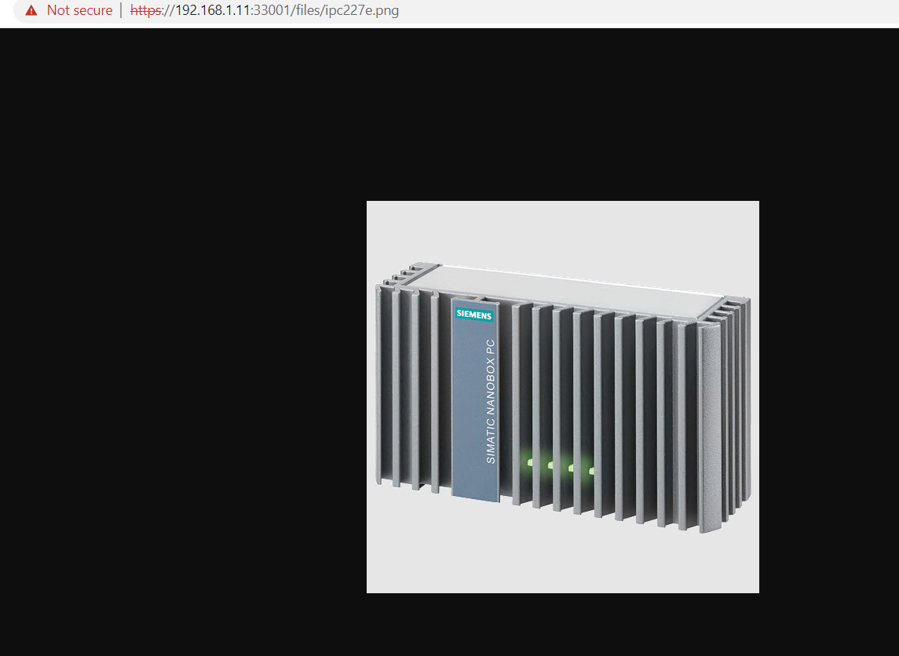

#### Display image in a Grafana dashboard

- From the Grafana Home Page create a new dashboard or open an existing one
- Insert a new panel using the **Add Panel** button
- Select the **ePict Panel** Panel as visualization type
In the **Background URL** field, insert the URL previously generated by the grafana-static-server service.

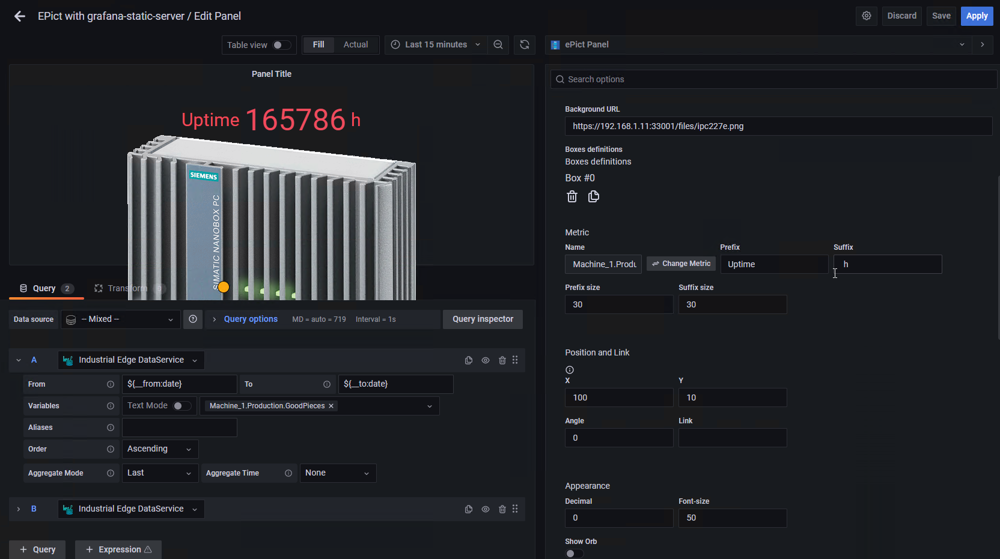

- To visualize data superimposed on the image, it is possible to insert different **Boxes** by parameterizing the **Metric** field with a variable coming from a query made through the configured Datasources. Parameterize also the **Position** and **Appearance** sections to move and color the data at will, even with thresholds applied.

Above are displayed data via the **industrialedge-dataservice-datasource**. For more information on this Datasource see the [application example](#viewing-data-using-industrial-edge-dataservice-datasource) above.

## Build

The edge-grafana application is built from a Docker Alpine image where a version of Grafana is installed with some customizations such as preconfigured datasources provisioning, dedicated settings for operation and the industrialedge-dataservice-datasource plugin.

Refer to the [Dockerfile](grafana/Dockerfile) used for building the image.

### Building Steps

- Download [Grafana Standalone Linux Binaries](https://grafana.com/grafana/download/8.2.5?pg=get&plcmt=selfmanaged-box1-cta1)
- Edit [defaults.ini](https://grafana.com/docs/grafana/latest/administration/configuration/) properties (e.g. BASE_PATH)
- Created **custom datasources** for edge-mysql, edge-postgresql, edge-influxdb, edge-influxdb2 in provisioning folder
- Compress to **tar.xz** the new grafana installer folder
- Add **Plugins** in Dockerfile on Grafana installing

### Grafana Configuration Changes

Below are the options in the `conf/defaults.ini` file that have been changed in the edge-grafana application from the default settings offered by Grafana:

```ini
# The full public facing url
root_url = %(protocol)s://%(domain)s:%(http_port)s/${BASE_PATH}

# Serve Grafana from subpath specified in `root_url` setting. By default it is set to `false` for compatibility reasons.
serve_from_sub_path = true

# Limits the number of rows that Grafana will process from SQL data sources.
row_limit = 10000000

# Server reporting, sends usage counters to stats.grafana.org every 24 hours.
# No ip addresses are being tracked, only simple counters to track
# running instances, dashboard and error counts. It is very helpful to us.
# Change this option to false to disable reporting.
reporting_enabled = false

# Set to false to disable all checks to https://grafana.com
# for new versions (grafana itself and plugins), check is used
# in some UI views to notify that grafana or plugin update exists
# This option does not cause any auto updates, nor send any information
# only a GET request to https://grafana.com to get latest versions
check_for_updates = false

# set to true if you host Grafana behind HTTPS. default is false.
cookie_secure = true

# set cookie SameSite attribute. defaults to `lax`. can be set to "lax", "strict", "none" and "disabled"
cookie_samesite = none

# set to true if you want to allow browsers to render Grafana in a <frame>, <iframe>, <embed> or <object>. default is false.
allow_embedding = true

# Set to true to enable the X-XSS-Protection header, which tells browsers to stop pages from loading
# when they detect reflected cross-site scripting (XSS) attacks.
x_xss_protection = false

disable_sanitize_html = true

# Enter a comma-separated list of plugin identifiers to identify plugins to load even if they are unsigned. Plugins with modified signatures are never loaded.
allow_loading_unsigned_plugins =industrialedge-dataservice-datasource
```

## Documentation

- [Grafana - Documentation Home Page v 8.2](https://grafana.com/docs/grafana/v8.2/)
- [Grafana - How to use Postgresql Datasource](https://grafana.com/docs/grafana/latest/datasources/postgres/)
- [SIOS - DataService Application Manual](https://support.industry.siemens.com/cs/ww/en/view/109781417)
- [SIOS - Dataservice Development Kit](https://support.industry.siemens.com/cs/ww/en/view/109792717)
- [IndustrialEdge GitHub - DataService Development Kit Getting Started](https://github.com/industrial-edge/data-service-development-kit-getting-started)

You can find further documentation and help about Industrial Edge in the following links:

- [Industrial Edge Hub](https://iehub.eu1.edge.siemens.cloud/#/documentation)
- [Industrial Edge Forum](https://www.siemens.com/industrial-edge-forum)
- [Industrial Edge landing page](https://new.siemens.com/global/en/products/automation/topic-areas/industrial-edge/simatic-edge.html)
- [Industrial Edge GitHub page](https://github.com/industrial-edge)
- [Industrial Edge App Developer Guide](https://support.industry.siemens.com/cs/ww/en/view/109795865)

## Contribution

Thanks for your interest in contributing. Anybody is free to report bugs, unclear documentation, and other problems regarding this repository in the Issues section or, even better, is free to propose any changes to this repository using Merge Requests.

## License & Legal Information

Please read the [Legal Information](LICENSE.md).
